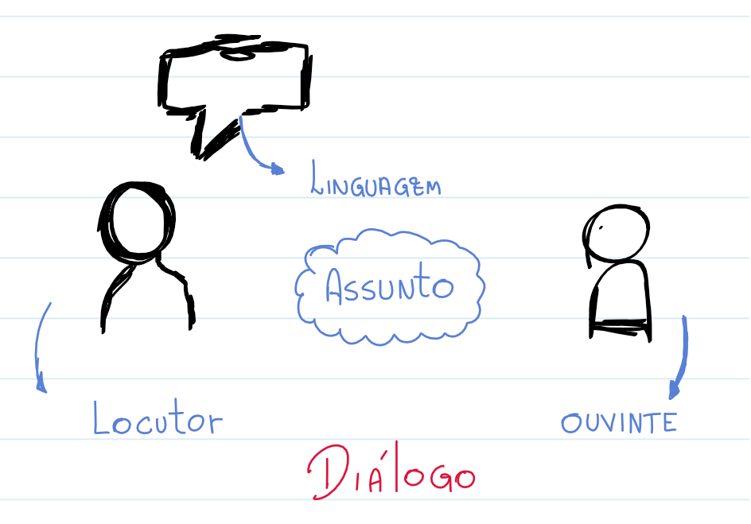
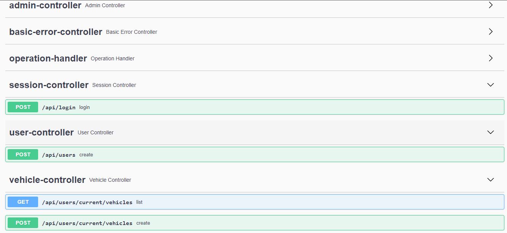
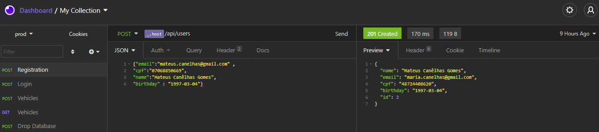
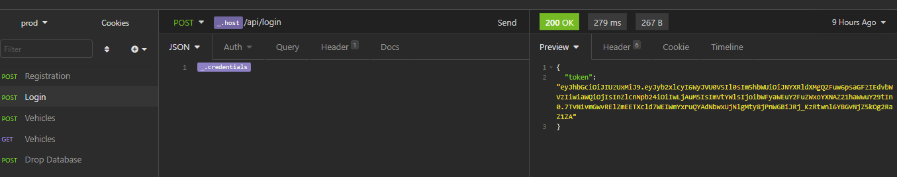
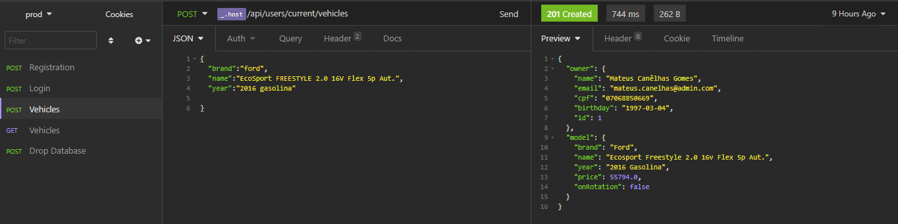
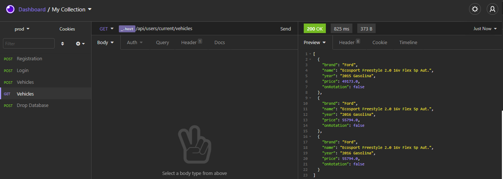

A maior parte do meu esforço técnico foi direcionada para a [implementação](https://github.com/canelhasmateus/cars).   O texto foi feito de uma forma mais lúdica para leigos.

# 
``Ato 1``

>   - Môr.
>    - Hm.
>    - Moooor.
>    - Hmmmmmmmmmmm
>    - Cê não tá me ouvindo não?!
>    - Já te respondi pessoa, diz o que precisa . . .
>    - Como que o iFood sabe que eu pedi comida?
>    - Cê tá pensando demais denovo né kkkkkkkkkkkk Seu celular manda o pedido através da internet uai
>    - Esse tanto eu sei né, queria entender um pouco mais a fundo. Não é isso que vocês fazem no trabalho? Mexer com internet?
>    ``< Sarcasticamente >`` Claro que não. A gente formata computador também.
>    - Engraçadinho. Agora me explica como funciona.

>   - Certo. Assim como em outros aspectos da vida, tudo se resolve na conversa. Pra computadores também acontece a mesma coisa. Olha esse diagrama aqui:
>    - Via de regra, na internet, tanto o locutor quanto ouvinte são ambos computadores. Sobra a linguagem e o assunto.
>    - Certo...
>    - A parte da linguagem não é interessante te explicar agora, mas saiba que existem algumas mais padrão, tipo HTTP. A parte legal é o assunto.
>    - Como assim?
>    - Bom, enquanto a skynet não for uma realidade, computadores tem que ser programados pra exercerem as funções que eles fazem certo? Então, eles so conseguem entender algumas coisas pre-definidas. Então a gente cria um manual dos assuntos e das formas que você pode conversar com ele.
>   - Ainda não entendi.
>   - Aqui um exemplo ó. Tá vendo essa listinha? É um manual de todas as coisas que você pode conversar com esse computador, e as coisas que ele pode te responder.

>   - Parece um cardápio.
>    - Você só pensa comida né. Por sorte, essa é uma analogia muito boa, então vou continuar nela. Pensa dessa forma: Quando você vai num restaurante, não dá muito certo você pedir algo fora do cardápio, certo? Eles provavelmente não vão conseguir te atender.
>    - Entendi. Mas fiquei com uma dúvida.
>    - Diga.
>    - O ouvinte é sempre mais feinho mesmo?
>   
 ``< silêncio >`` 
 

# 
``Ato 2``

>   - Então, é isso. A gente chama essa junção de computadores + cardápio de API. Na analogia do restaurante, seria tipo um balcão. Seu celular faz uma chamada no balcão, avisando que você
> pediu tal coisa.
>    - Tipo um garçom?
>    - Na real que sim. Essa analogia do restaurante ta sendo mais completa do que eu imaginava.
>  
``< Risos sociais >``

>  - E tem diferença, uma API das outras? Igual a gente vê em restaurante?
>    - ô, se tem. O que você espera encontrar num restaurante? E o que você leva em conta pra saber se você vai voltar?
>    - Ah, espero que tenha algumas mesas, pra gente sentar e comer. Comparo atendimento, se é bom e rápido . . . Tem também o ambiente, se é limpinho, aconchegante.
>    - É. A gente tem um conceito bem parecido. O mais comum é que uma API, quando é construída, tenha 3 "camadas": A camada de apresentação lida com os clientes, só repassando pedido - Tipo
> um garçom. A gente também costuma ter uma camada de processamento, que é onde a gente faz o que é preciso pra atender seu pedido. Seria a cozinha.
>    - Ta. e a 3a?
>    - Não sei bem como que ela encaixa nessa analogia. Ela é de persistência, que é onde a gente salva dados. . .
>    - Tipo a geladeira , e o freezer? Um estoque, onde você guarda o que é importante pra você conseguir atender os pedidos depois?
>    - É. Algo do tipo. A parte importante é que exista a maior separação possível entre essas áreas. Você não quer que a pessoa que faz seu prato também seja a pessoa que devolve troco no
> caixa sabe? Não  que não funcione, só é bem anti-higiênico. E ineficiente também.
>    - Entendi. esse nível de organização varia de restaurante pra restaurante. Imagino que a analogia continua?
>    - Claro. E a diferença é entre o master chef e um pesadelo na cozinha. 

# 
``Ato 3``

>   - Só pra ficar ainda mais claro, dá uma olhada nisso aqui.
>  
``< Magicamente digita o programa do repositório no tempo entre as duas sentenças>``

>   - Nossa, foi muito rápido. É facil assim?
>    - Ah, nem tanto. Acaba sendo mais rápido porque existem ferramentas que ajudam nessa construção. A gente chama de frameworks.
>    - E qual a analogia disso com o restaurante?
>    - Aí você me apertou sem abraçar. Mas o que eu queria te mostrar era essa parte. Esse aqui é um programa que a gente usa pra conversar com a API.
>    - Achei bonitinho. Parece fácil de usar.
>    - É sim.
>    - Essa listinha aí é dos itens que a gente pode pedir?
>    - Isso mesmo. Vou fazer uma simulação aqui pra você:

 A gente faz um cadastro,

 Depois um login,

- Aí conseguimos registrar carros no cadastro,

- E ler eles denovo, juntamente com algumas informações adicionais, tipo o preço dele na tabela FIPE.
  

>    - E pra que serve?
>    - Honestamente, essa aqui é mais didatica mesmo. Só um exemplo de como que APIs podem conversar entre si.
>    - Então a gente pode ter uma API chamando outra?
>    - Claro. A gente consome o trabalho de outras pessoas o tempo todo. Da mesma forma, um restaurante também. Imagina se pra todo pedido eles tivessem que plantar e colher os ingredientes?
>    - Eles não fazem isso? Pelo tempo que demora, achei que fosse esse o caso.

>   - Engraçadinha. Mas sanou suas duvidas?
>    - Ficou um pouco mais claro sim.
>    - Que bom. Fico até surpreso, que você tenha entendido tão fácil e rápido.
>    - É porque sou muito inteligente e esforçada, e definitivamente não um figmento da sua imaginação, cumprindo a trope de proxy de exposição pra um texto de processo seletivo.
>    - Faz todo o sentido.
>    - Inclusive, falando em trabalho, vou precisar de uma ajuda com aquela segunda parte que você faz.
>    - Segunda parte? Como assim?
>    - Ah, meu notebook tá meio lento. Formata pra mim?