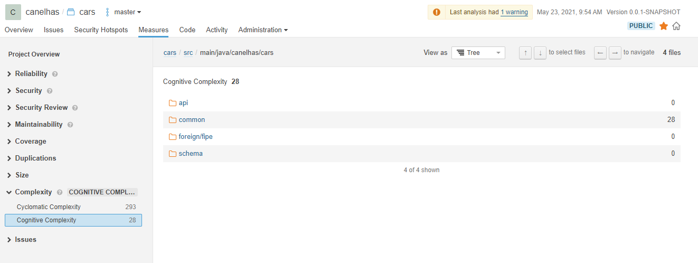

### Não usar lombok é masoquismo, não desafio.

1. Uma contra proposição auto-imposta:
   ``canelhas.cars.api..* Não conterá estruturas de fluxo de controle.``

2. Estão proibidos o uso direto das seguintes diretivas:
   ``try , catch , finally, if , else if, else , throw, for , switch , case e ternários.``

3. O cumprimento dessa imposição é demonstrado pela complexidade cognitiva nula dentro da package, bem como na maior parte do projeto.

   

# Features

1. Infrastructure as code via Terraform
2. Pipelines de teste, build e deploy via GitHub Actions
3. Api via CloudFront + Beanstalk
4. QA via SonarCloud
5. Debug remoto liberado
6. Controle de Acesso ( Is this even a feature? )

# Urls

1. [**Sonar**](https://sonarcloud.io/dashboard?id=canelhas-cars)
2. [**Documentação**](https://cars.canelhas.io/swagger-ui/index.html)

# Remarks

1. /support/http possui os arquivos necessários do imnsomnia.
2. fluxo de uso: Cadastro de Usuário -> Login -> Registro de veículo -> Consulta de veículos.
3. Existe um bug que acontece quando o usuário especifica um ano incompativel com o modelo. Poderia arrumar, mas não vou. Avisando pra não estranhar o 404 com html que você vai receber.
4. Gosto de aspects.
5. Odeio frameworks.
6. Aceito feedbacks.
7. Provavelmente vou formalizar a idéia do languaj.
8. Algumas partes estão menos legíveis devido as imposições, mas ficou MUITO melhor do que pensei inicialmente.
9. Batendo o olho, não senti valor no feign, por isso não usei. Adoraria ser convencido do contrário.
10. Não consegui pushar as Docker Images pra um repositório público. Se alguém souber o porque, me diga.
11. Overkill total, eu sei. Poderiam fazer uma reavaliação técnica?
    